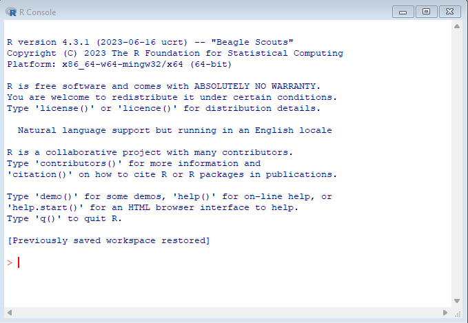
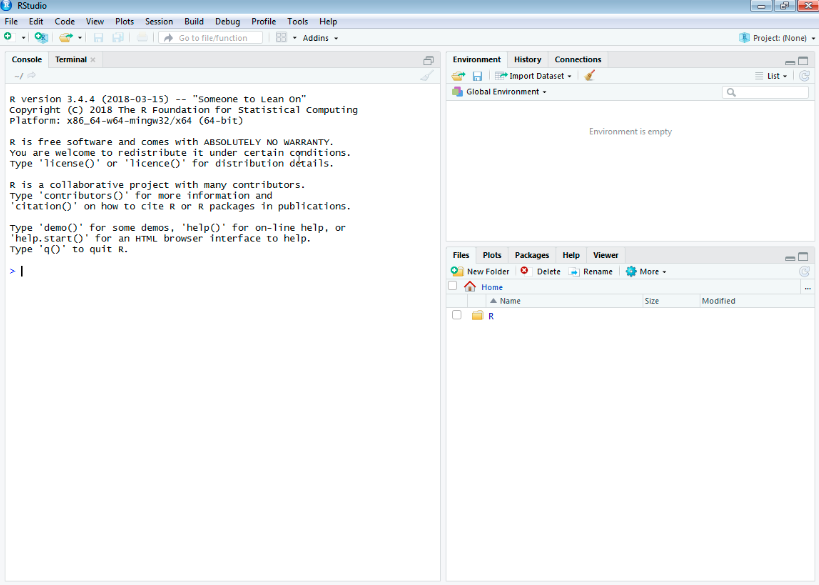
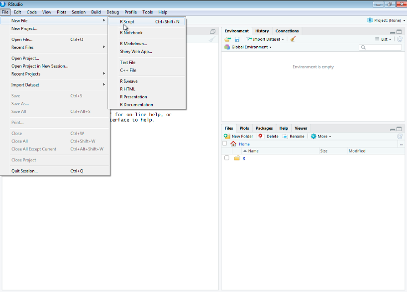
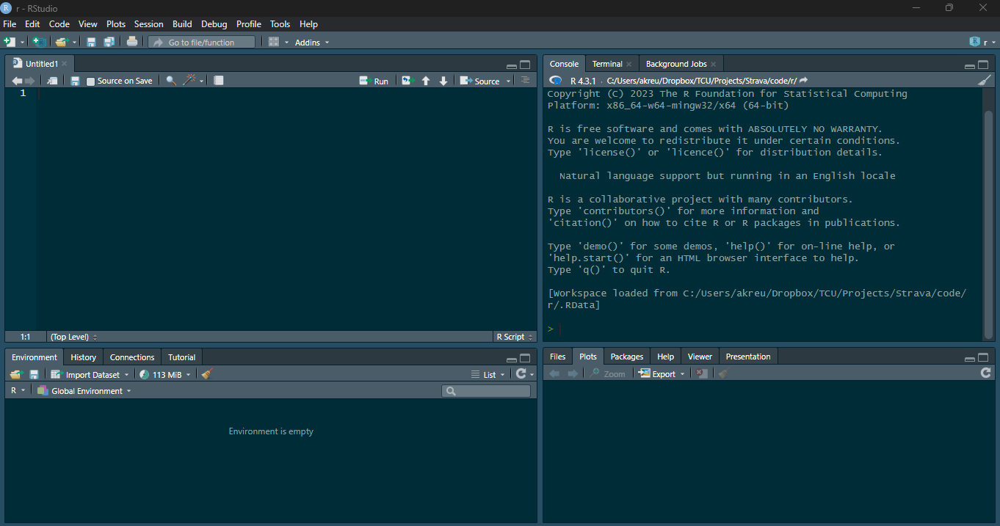

# R & tidyverse basics
Andreas Kreutzer

## R & RStudio

I will use R and RStudio to create different plots. I will provide all
code and output in a separate document before the Lunch & Learn in case
you would like to follow along or try the code on your own.

**Click**
<a href="https://rstudio-education.github.io/hopr/starting.html"
target="_blank" title="How to install R &amp; RStudio">here</a> for a
**guide to installing R & RStudio**.

## Why use R at all?

- R was specifically developed as a statistical environment for data
  analysis.

- It has a large support community that creates and maintains packages
  that allow you to perform almost any analysis you could possibly
  imagine.

- It is free and runs on all major operating systems.

- It allows you to save and share your work easily, which facilitates
  reproducibility and open science practices.

- It integrates easily with services such as GitHub that make
  collaboration and version control easy

## The R Console

You will use the console to perform data wrangling, analysis, and
visualization. You can start an R console by simply starting R on your
computer.Your console will look like this:



You can do everything you need in this console. However, using an
*integrated development environment* (IDE) like RStudio has many
benefits.

## RStudio

RStudio lets you easily create scripts of your code, which you can save
for future use, edit as required, and share with collaborators or the
world. It also offers many features that make coding (and publishing)
easier: auto-completing and highlighting errors in your code, allowing
you to create webpages (such as this one), manuscripts, and entire books
with integrated (and if you want interactive) code, and much more.

RStudio will open with three panels, showing the console on the left:



You can use the console to perform operations or open a new script to
start typing and saving your code. By default, the new script will be
added as a fourth panel in the top left and push the console to the
bottom left.



When you run code from the script, your code and its output will
automatically be shown in the console. By default, **plots** and
rendered tables will be shown in the **bottom right** **panel**, which
also has tabs for files, packages, etc.

**\*\*\*Note that your plot will be rendered to conform to the size of
your panel. So depending on how you have the size set, the plot might
look funny initially. You can change the size of the panel at any time
and the plot will adjust. You can set a specific size and resolution
when you save or export the plot.**

There are endless options to customize the appearance of RStudio,
including switching to a “dark” mode that saves your eyes during long
coding sessions and changing the layout of the panels. You can make
adjustments via Tools -\> Global Options.

I like to use a dark theme with the script in the top left, console in
the top right, and the plot panel in the bottom right:



## R basics

### Packages

While you can do most operations in “base R”, the strength of R really
comes into play when you start installing packages that were created
specifically to perform certain operations such as advanced statistical
procedures, plotting, etc.

In RStudio, you can install packages using point-and-click via Tools -\>
Install Packages. You can also use code to do this, which is the more
common way of installing and loading packages.

The below code chunk shows you how to do this. Note, the lines starting
with a \# are “commented out”, meaning they will not be executed by the
program. You can use this to include comments in your code for
reproducibility and to remember what you were doing in a script when you
come back to it after a while.

``` r
#installing packages is done using the install.packages() function
install.packages("tidyverse")(eval = FALSE)

#once you have downloaded the package, you need to install it using the library() function
library(tidyverse)(eval = FALSE)
```

**Note** that the install.packages() function requires quotation marks,
while the library() function does not.
